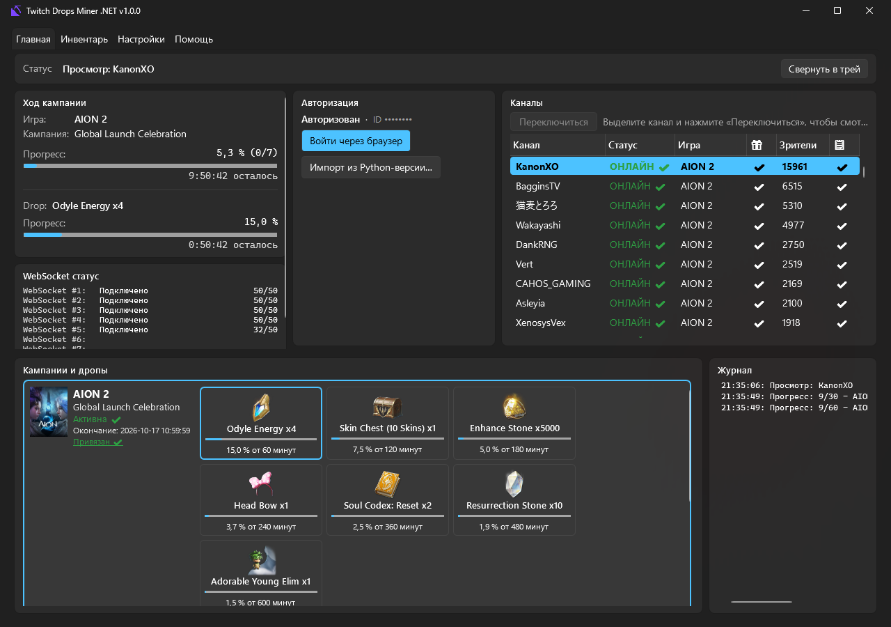
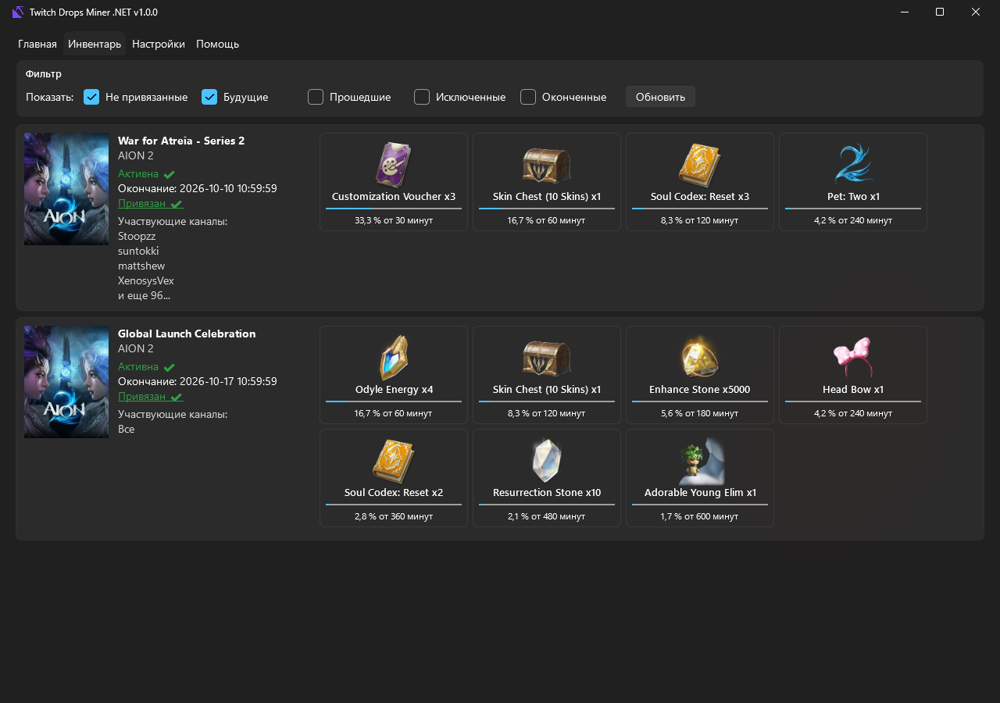
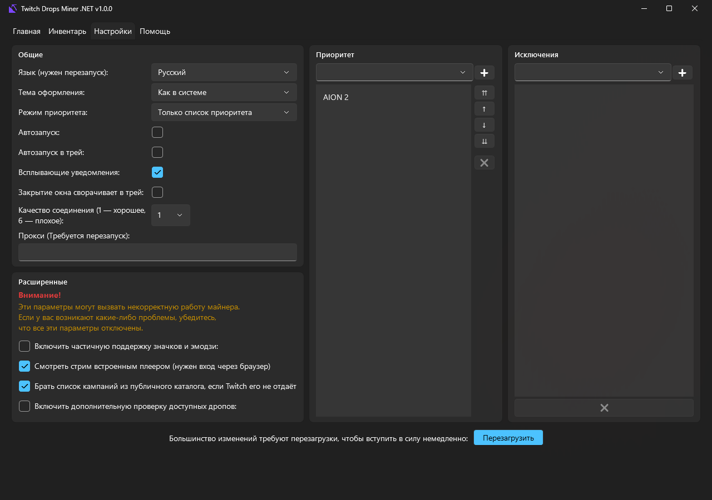

# Twitch Drops Miner .NET

[](https://github.com/Neerols/TwitchDropsMiner.NET/actions/workflows/build.yml)
[](https://github.com/Neerols/TwitchDropsMiner.NET/releases/latest)
[](https://github.com/Neerols/TwitchDropsMiner.NET/releases)


Приложение собирает награды Twitch Drops в фоне. Оно само выбирает канал и переключается, когда стрим заканчивается, само забирает готовые награды и следит за новыми кампаниями.

Это порт [Twitch Drops Miner](https://github.com/DevilXD/TwitchDropsMiner) от DevilXD (и форка [Davixk](https://github.com/Davixk/TwitchDropsMiner)) с Python/tkinter на **C# / .NET 10 / WPF** для Windows. Функции те же, но интерфейс не тормозит и всё работает после изменений Twitch осенью 2026 года.

## ⬇️ Скачать

**[Последний релиз](https://github.com/Neerols/TwitchDropsMiner.NET/releases/latest)**

| Файл | Для кого |
|---|---|
| `TwitchDropsMiner-portable-win-x64.exe` | **Рекомендуется.** Один файл, ничего устанавливать не нужно |
| `TwitchDropsMiner-framework-win-x64.exe` | Маленький файл. Нужен [.NET 10 Desktop Runtime](https://dotnet.microsoft.com/download/dotnet/10.0) |

### Как это работает

Приложение выбирает канал, где идёт нужная кампания, и смотрит его **настоящим плеером Twitch в скрытом окне** встроенного браузера: без звука, в минимальном качестве 160p. С осени 2026 года Twitch засчитывает время просмотра только так.

Реальный прогресс дропов берётся со страницы инвентаря Twitch. Статусы каналов (в сети или нет, число зрителей) приходят по websocket-соединениям Twitch PubSub.

### Возможности

- Майнинг дропов в фоне: скрытый плеер, без звука, 160p.
- Списки **приоритета** и **исключений** игр и три режима приоритета.
- Отслеживание до **199 каналов** одновременно (до 8 websocket-соединений).
- Автоматическое переключение канала, если стрим закончился или в сеть вышел канал с более приоритетной игрой.
- Автоматическое получение готовых наград.
- Кампании ищутся автоматически по привязанным аккаунтам. Привязку нужно сделать самому на [странице кампаний](https://www.twitch.tv/drops/campaigns).
- **Вход через браузер:** логин, пароль и 2FA вы вводите только на сайте Twitch. Сессия сохраняется, входить каждый раз не нужно.
- Главная вкладка показывает кампании и прогресс каждого дропа с картинками наград.
- Иконка в трее, уведомления о полученных дропах, автозапуск с Windows, тёмная и светлая тема, прокси, 21 язык интерфейса.
- Списки приоритета и исключений из Python-версии импортируются автоматически, если положить exe в её папку.

### Использование

1. Скачайте `TwitchDropsMiner-portable-win-x64.exe` из [релиза](https://github.com/Neerols/TwitchDropsMiner.NET/releases/latest) и положите куда удобно. Рядом с ним ничего не создаётся: данные хранятся в `%LOCALAPPDATA%\TwitchDropsMiner`.
2. Запустите, нажмите **«Войти через браузер»** и войдите в Twitch в открывшемся окне.
3. Приложение загрузит доступные кампании. На вкладке **«Настройки»** добавьте нужные игры в список **«Приоритет»**: майнинг начнётся через пару секунд.
4. Чтобы майнер добывал и то, чего нет в списке, выберите режим приоритета «Сначала заканчивающиеся» или «Сначала с малым запасом времени».
5. Привяжите аккаунт Twitch к играм на [странице кампаний](https://www.twitch.tv/drops/campaigns), чтобы добывать больше.

Подробно обо всём (вкладки, настройки, параметры командной строки, файлы, решение проблем, устройство кода) — в **[руководстве](docs/GUIDE.md)**.

### Скриншоты





### Примечания

> [!WARNING]
> Не смотрите стримы в обычном браузере тем же аккаунтом, пока работает майнер. Twitch засчитывает прогресс только по одному просмотру за раз, и майнер начнёт вести себя непредсказуемо. Не запускайте одновременно этот майнер и оригинальную Python-версию.

> [!IMPORTANT]
> Папки `browser\` и `config\` в `%LOCALAPPDATA%\TwitchDropsMiner` содержат вашу сессию Twitch. **Никому их не передавайте.** Файл `auth.bin` зашифрован средствами Windows и на другом компьютере не откроется. Чтобы выйти, нажмите «Выйти» в блоке «Авторизация» на главной вкладке или удалите эту папку.

> [!NOTE]
> Скрытый плеер занимает около 600 МБ памяти и 1–2 % процессора. Это плата за то, что Twitch засчитывает просмотр (подробности в начале [руководства](docs/GUIDE.md)).

Поддерживаются только кампании **Drops**, где награду дают за время просмотра. Кампании-«Rewards» и дропы за подписку не поддерживаются, как и в оригинале.

### Сборка из исходников

Нужен [.NET 10 SDK](https://dotnet.microsoft.com/download/dotnet/10.0):

```bash
winget install Microsoft.DotNet.SDK.10
```

Сборка обоих вариантов в `dist\`:

```bash
powershell -ExecutionPolicy Bypass -File build.ps1
```

Запуск для разработки:

```bash
dotnet run -- -vvv
```

Релизы собираются через GitHub Actions при публикации тега `v*`: см. [`.github/workflows/build.yml`](.github/workflows/build.yml).

### Отличия от оригинала

| | Python-оригинал | Эта версия |
|---|---|---|
| Интерфейс | tkinter, подтормаживает на вкладке «Инвентарь» | WPF, виртуализированные списки, картинки грузятся в фоне |
| Вход | по коду (с сентября 2026 новый вход не работает) | через встроенный браузер |
| Засчитывание просмотра | событие spade (с осени 2026 не засчитывается) | настоящий плеер в скрытом окне |
| Прогресс | из API (с осени 2026 скрыт) | со страницы инвентаря Twitch |
| Хранение токена | `cookies.jar` открытым текстом | `auth.bin`, зашифрован DPAPI |
| Изменения приоритета | только после «Перезагрузить» | применяются сами через 2 секунды |

### Благодарности

- [DevilXD](https://github.com/DevilXD) — автор оригинального [Twitch Drops Miner](https://github.com/DevilXD/TwitchDropsMiner). Иконки и файлы переводов взяты из оригинала. Поддержать автора: [Buy Me A Coffee](https://www.buymeacoffee.com/DevilXD).
- Авторам переводов оригинального проекта.

### Лицензия

[MIT](LICENSE). Приложение неофициальное и не связано с Twitch. Используйте на свой риск.
